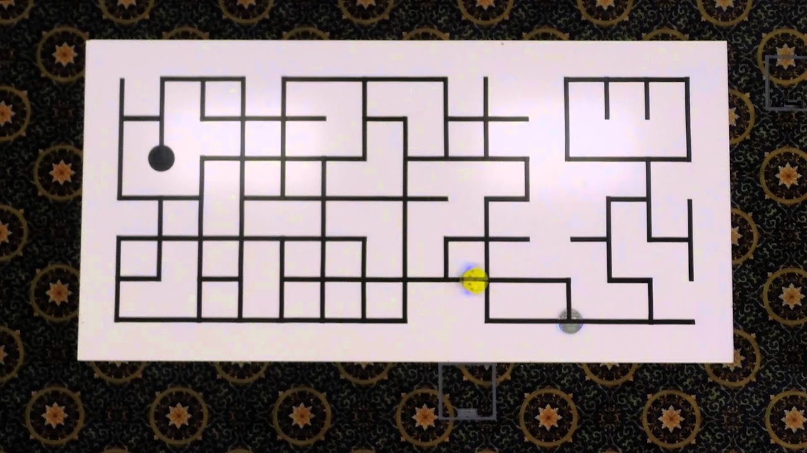
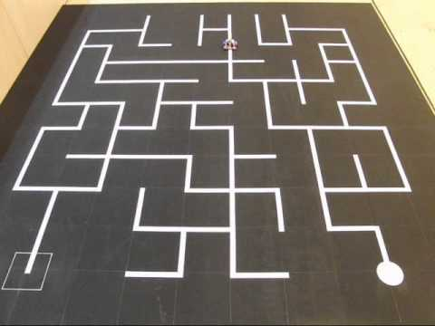

# maze-solver

Robot is programmed to follow white line over a black surface and use IR sensor array on the bottom of the bot to keep track of the line. The bot analyzes the path to solve the maze and find the shortest path with simple "left hand rule" method.

The bot analyses the path in Dry run and goes through the maze from starting point to end point in minimum possible time in Actual run. Below are the examples of maze layout.

 

 

